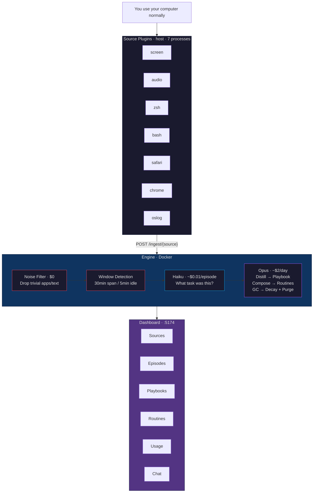

<div align="center">

# 👁️ Observer

**Watch what you do. Learn how you think.**

An always-on behavioral distillation engine that observes your screen, audio, shell, and browser — identifies discrete tasks — and distills recurring patterns into a personal Playbook.

[Quick Start](#quick-start) · [How It Works](#how-it-works) · [Source Plugins](#source-plugins) · [Architecture](#architecture)

</div>

---

## Highlights

- **7 data sources** — screen OCR, microphone transcription, zsh/bash history, Safari/Chrome tabs, macOS system logs
- **Plugin architecture** — drop a folder with `manifest.json` and your source auto-registers: DB table, dashboard panel, LLM context, GC policy
- **3-layer cost optimization** — rules filter ($0) → Haiku episodes (~$0.01) → Opus distillation (~$2/day)
- **Runs locally** — source plugins on host, engine + dashboard in Docker. Your data stays on your machine
- **Budget-aware** — configurable daily cap, real-time cost tracking in dashboard

## Quick Start

> **Prerequisites:** Docker, [uv](https://docs.astral.sh/uv/), Node.js

```bash
npm run setup     # install deps + build Docker images
npm start         # launch 7 source plugins + engine + dashboard
```

Create `.env` with your API key:

```
ANTHROPIC_API_KEY=sk-ant-...
```

Open **http://localhost:5174** — data starts flowing immediately.

```bash
npm run status    # see what's running
npm stop          # shut it all down
npm test          # lint + 320 engine tests + 17 Playwright e2e
```

## How It Works



### What comes out

| Output | What it is | Example |
|--------|-----------|---------|
| **Episode** | A discrete task you performed | "Debugged WebSocket reconnection logic in gateway" |
| **Playbook entry** | A recurring behavioral pattern | "When debugging async code, always checks connection lifecycle first" |
| **Routine** | A multi-step sequence of patterns | "Bug report → reproduce → isolate → fix → test → commit" |

## Source Plugins

All data collection is done by **source plugins** — independent processes that capture data and push it to the engine via HTTP.

### Builtin

| Source | Captures | How |
|--------|----------|-----|
| **screen** | Screenshots + OCR text | Core Graphics (macOS) / mss (Windows) + Vision/RapidOCR |
| **audio** | Speech transcription | sounddevice + Faster Whisper (local, no API) |
| **zsh** | Shell commands | History file tracking + SIGUSR1 flush |
| **bash** | Shell commands | History file tracking |
| **safari** | Active tab URL | AppleScript |
| **chrome** | Active tab URL | AppleScript |
| **oslog** | App launch/quit, sleep/wake, lock | `log stream` + ijson |

### Write Your Own

Create a directory with three files:

```
my_source/
├── manifest.json        # What: DB schema, UI, context format, GC
├── pyproject.toml       # Deps: source-framework + your libs
└── src/my_source/
    └── __init__.py      # Code: probe() + collect()
```

The plugin interface is two methods:

```python
from source_framework.plugin import SourcePlugin, ProbeResult

class MySource(SourcePlugin):
    def probe(self) -> ProbeResult:
        """Can this source run here?"""
        return ProbeResult(available=True, source="my_source", description="ready")

    def collect(self) -> list[dict]:
        """Return new records. Called every interval_seconds."""
        return [{"timestamp": now(), "data": "something happened"}]
```

**`manifest.json`** tells the engine everything else — table columns, which columns to search, how to format for LLM context, when to garbage collect:

```json
{
  "name": "my_source",
  "display_name": "My Source",
  "entrypoint": "my_source:MySource",
  "db": {
    "table": "my_source_data",
    "columns": {
      "timestamp": "text not null",
      "data": "text not null default ''"
    }
  },
  "ui": { "visible_columns": ["timestamp", "data"] },
  "context": { "format": "[{timestamp}]: {text}" },
  "config": { "interval_seconds": {"default": 5} }
}
```

Drop it in `sources/builtin/` and restart. The engine creates the table, the CLI starts the process, and the dashboard renders a new panel. Zero glue code.

## Architecture

```
sources/
├── framework/               Zero-dep Python package
│   └── src/source_framework/   SourcePlugin ABC, manifest loader,
│                                EngineClient, runner (__main__)
└── builtin/                 7 plugins, each with own venv
    ├── screen/   audio/   zsh/   bash/
    ├── safari/   chrome/  oslog/
    └── (your plugin here)

src/engine/                  FastAPI + Huey + PostgreSQL
├── api/routes.py            /ingest/{source}, /sources/{name}/data, /engine/*
├── etl/                     Frame entity, noise filter, window detection
│   └── sources/manifest_registry.py   Scan → CREATE TABLE → register
├── pipeline/                Episode extraction, distillation, routines
├── scheduler/tasks.py       Huey: on_new_data, process_episode, daily cron
├── agents/                  MCP tools for agentic GC/distill/compose
├── storage/                 PostgreSQL models + async/sync sessions
└── llm/                     Anthropic + OpenAI-compatible abstraction

web/src/                     Next.js dashboard
├── App.tsx                  Dynamic sidebar from GET /engine/sources
├── SourceDataPanel.tsx      Generic panel — renders any manifest source
└── {Episodes,Playbooks,Routines,Usage,Logs,Chat}Panel.tsx
```

## Data Flow

```
collect() → POST /ingest/{source} → PostgreSQL table
    → on_new_data (Huey)
    → noise filter + window detection
    → process_episode (Haiku: frames → task summaries)
    → daily_distill (Opus: episodes → playbook entries)
    → daily_routines (Opus: playbooks → routines)
    → daily_gc (Opus: decay confidence, purge old data)
```

## Commands

| Command | What it does |
|---------|-------------|
| `npm start` | Start 7 source plugins + Docker (engine, web, db) |
| `npm stop` | Stop everything |
| `npm run restart` | Stop + start |
| `npm run status` | Show running processes + API health |
| `npm run logs` | Docker compose logs |
| `npm test` | Lint + engine pytest + framework tests + Playwright e2e |

## Testing

All tests run in Docker. No host dependencies beyond Docker + uv.

```bash
npm test                # everything
npm run test:sources    # framework unit tests only
```

367 tests: 320 engine (pytest/PostgreSQL) + 30 framework + 17 Playwright e2e.

## License

[AGPL-3.0](LICENSE). Free for personal use. Corporations: open-source your modifications or [purchase a commercial license](mailto:nickmaxzhang@gmail.com).

---

<div align="center">
<sub>Built for personal use. Your data never leaves your machine.</sub>
</div>
